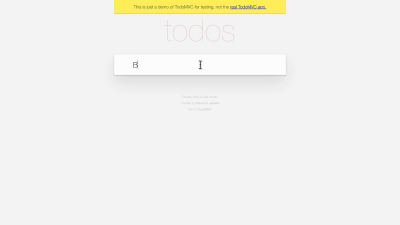

# saas-training-videos

An open, agent-agnostic skill for producing **narrated, screen-recorded training videos of any web app** — courses,
tutorials, how-tos, onboarding walkthroughs — with **any AI agent**: ChatGPT / Codex, Claude, Gemini, Cursor, Copilot,
Goose, Aider, your own framework, or a person following the steps.



*From `examples/todomvc/`: a scripted take, a drawn cursor (arrow / I-beam / hand), a zoom on the field being typed.*

## What it does

```
PLAN       course plan → per video: explore the real screens → brief
SIGN IN    a human operator logs in once per account; the agent never handles credentials
RECORD     scripted Playwright takes in real Chrome → tighten → click list
WRITE      narration written to the footage, TTS-ready
VOICE      audition → ElevenLabs v4 (soft breaths) / OpenAI TTS / human recording → gap check
EDIT       click-to-word sync, drawn cursor + click rings, zooms → 1080p, −16 LUFS MP4
QA         checklist → hand-off
```

| Part | Highlights |
|---|---|
| **Planning** (`references/planning.md`, `video-structure.md`, templates) | intake questions, course → modules → videos, briefs from a task analysis of the real app, pilot-first, review gates, LLM script drafting rules |
| **Authenticated sessions** (`references/authentication.md`) | operator hand-off protocol (`login --until`, `status`), SSO, magic links, passkeys, CAPTCHAs, remote agents, account prep, security rules |
| **Recorder** (`scripts/pw_record.py`) | one saved login per account; takes are small JS files with human-paced helpers (`hover`, `click`, `type`, `smooth` scroll, `dismiss` popups…); automatic logging inside iframes; stray-mouse filtering; fake microphone input |
| **Human-like voice** (`references/human-voiceover.md`, `scripts/voiceover.py`) | ElevenLabs v4 settings that work, audio-tag usage (`[inhales]`, `[warmly]`…) and what to avoid, writing text for TTS, cloning with consent; voice search, side-by-side auditions, OpenAI TTS, macOS `say`, Whisper alignment for human narration |
| **Editor** (`scripts/assemble_video.py`) | phrase-anchored sync, real-speed footage that holds where the voice needs time, drawn cursor, phrase-timed zooms and gestures, stills, slides, presenter PiP, intro/outro, transitions, two-pass loudnorm |
| **QA** | `voice_gaps.py`, `sync_tools.py`, `contact_sheet.py`, `pointer_events.py`, and a checklist |

## Install (pick your agent — details in [`docs/agents.md`](docs/agents.md))

```bash
# OpenAI Codex CLI
git clone https://github.com/jamoyex/saas-training-videos ~/.codex/skills/saas-training-videos
# Claude Code
git clone https://github.com/jamoyex/saas-training-videos ~/.claude/skills/saas-training-videos
# Anything that reads AGENTS.md (Cursor, Copilot, Gemini CLI via GEMINI.md, Goose, Aider, Jules…): clone into your project
git clone https://github.com/jamoyex/saas-training-videos
```
**ChatGPT / Claude.ai skill uploads**: download `saas-training-videos.zip` from
[Releases](https://github.com/jamoyex/saas-training-videos/releases) (or build it: `python3 scripts/package_skill.py`).
Cloud chat assistants can plan, write the scripts/takes/EDLs and choose voices; recording runs on a machine with Chrome.

Requirements for recording and rendering: macOS or Linux, Python 3.10+ (`pip install numpy pillow`), ffmpeg,
Google Chrome, Node.js + `npm i -g @playwright/cli`, a display (Xvfb on servers). Optional: whisper.cpp,
ElevenLabs / OpenAI keys (`templates/config.example.env`).

## Quick start

```bash
S=scripts   # inside the skill folder
python3 $S/pw_record.py login myapp https://app.example.com/login --until "/dashboard"   # the operator signs in
python3 $S/pw_record.py take  myapp screen/steps/S01.js screen/raw/S01.webm
python3 $S/tighten.py screen/raw/S01.webm screen/tight/S01.mp4 --log screen/raw/S01.pointer.json
python3 $S/pointer_events.py . S01                                       # click times → EDL anchors
python3 $S/voiceover.py audition --voices VOICE_A VOICE_B --script script.md --seg S01
python3 $S/voiceover.py speak script.md --voice VOICE_A --model eleven_v4 --stability 0.35 --speed 0.95 --out vo
python3 $S/voice_gaps.py edl.json
python3 $S/assemble_video.py edl.json
```
A complete worked example (public demo app, no login): [`examples/todomvc/`](examples/todomvc/).

## Principles

- Plan from the real screens; every label in the script matches the UI.
- Footage plays at real speed and the audio is never cut: slow steps get room from a few more natural words.
- Say it, then do it: each click lands just after its phrase.
- A human operator owns the account: they sign in and approve changes; agents never handle credentials, never buy,
  delete or message real people on camera, and record only the page.
- Demo data only on screen; clone or imitate a real person's voice only with their consent.

## Contributing

See [`AGENTS.md`](AGENTS.md) (also the instructions coding agents read). Keep it agent-agnostic and dependency-light;
test on `examples/todomvc` before opening a PR.

## License

[MIT](LICENSE)
